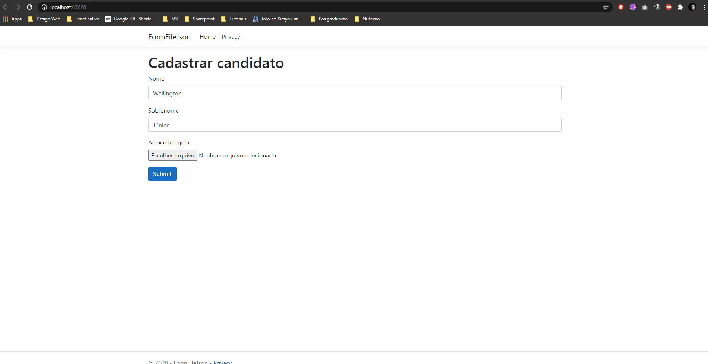

# IFormFile With JsonObject

A simple aspnet core project, which implements the ModelBinder extension to allow sending data with files on the same object.

## Usage

1. Create a viewModel with the IFormFile for use in your application, in this project is represented by **CandidatoViewModel**
  ```
public class CandidatoViewModel
{        
    public string Nome { get; set; }
    public string Sobrenome { get; set; }

    public IFormFile ImagemUpload { get; set; }
}
  ```

2. Explicit the ModelBinder type with the extended ModelBinder class, the FormFileWithJsonModelBinder class
  ```
[ModelBinder(typeof(FormFileWithJsonModelBinder), Name = "candidato")]
public class CandidatoViewModel
  ```
 **The value of the "Name" attribute must be used in the form for binding to be performed.**
 
 3. In your Action it must contain the parameter with the type of Item 1.
 ```
 [HttpPost]
public JsonResult Index(CandidatoViewModel viewModel)
{            
    //if(!ModelState.IsValid) { do something... }

    var name = viewModel.Nome;
    var imagemFormFile = viewModel.ImagemUpload;
    // do something...
 ```
 
 4. Finally, this is an example of a request made by the frontend:
  ```
  const files = $('#imagemCandidato').get(0).files
  const candidato = {
      nome: $('#nome').val(),
      sobrenome: $('#sobrenome').val()
  }
  
  let form = new FormData()
  form.append("candidato", JSON.stringify(candidato))
  form.append("ImagemUpload", files[0], files[0].name)

  $.ajax({
      url: '/Home/Index',
      type: 'post',
      enctype: 'multipart/form-data',
      data: form,
      processData: false,
      contentType: false,
      success: res => { //..do something... },
      error: err => { //do something... }
  })
  ```
 ## Demonstration
 
 
 
